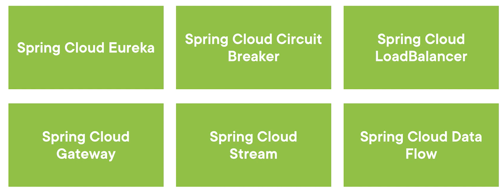
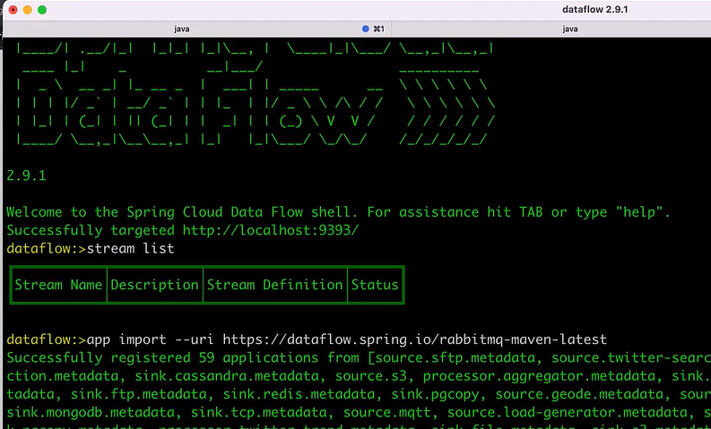
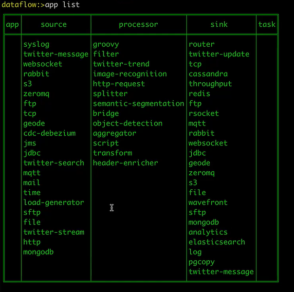
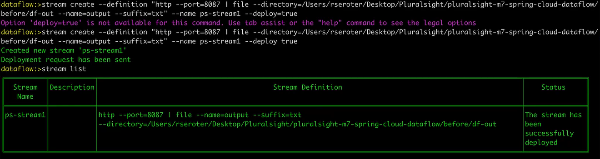
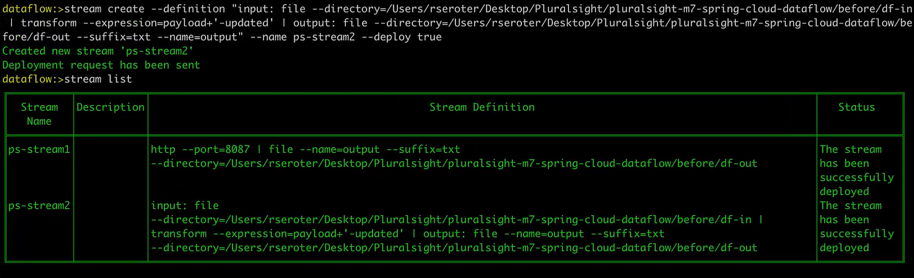
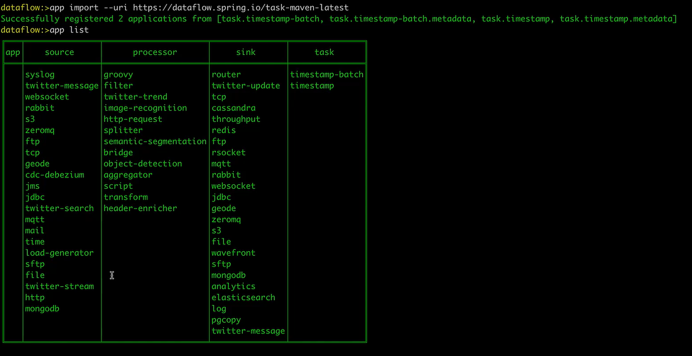
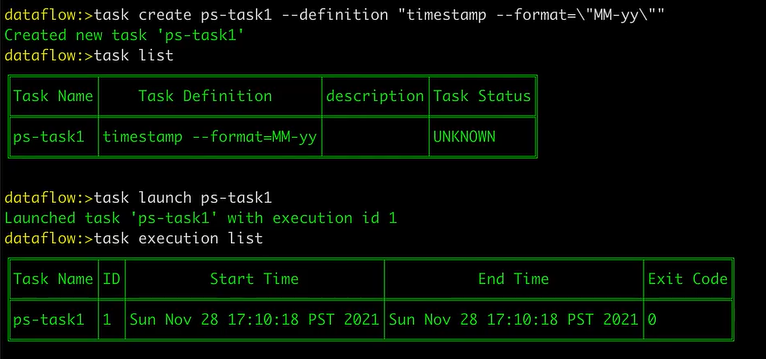
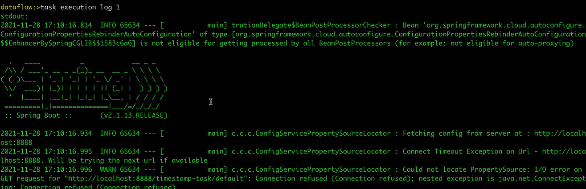

# MySpring

My Spring

## Spring Cloud

### Zipkin

Zipkin is a Java-based app used for distributed tracing and identifying latency issues. Unique identifiers are automatically attached to requests which are then passed downstream through the different waypoints, or services. Zipkin collects this data and allows users to analyze it in a UI.

## Components

Some of them

## Spring Pipeline

Spring stream pipeline / data flow

REST Post -> file

Tasks

Dashboard

## Spring Boot

## Spring
